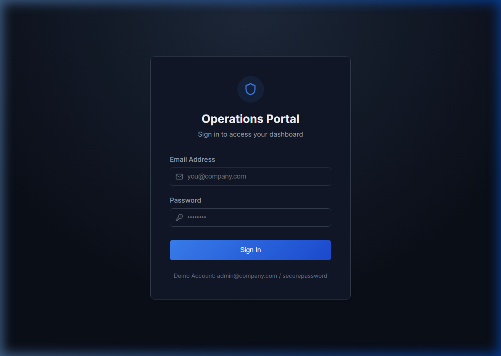
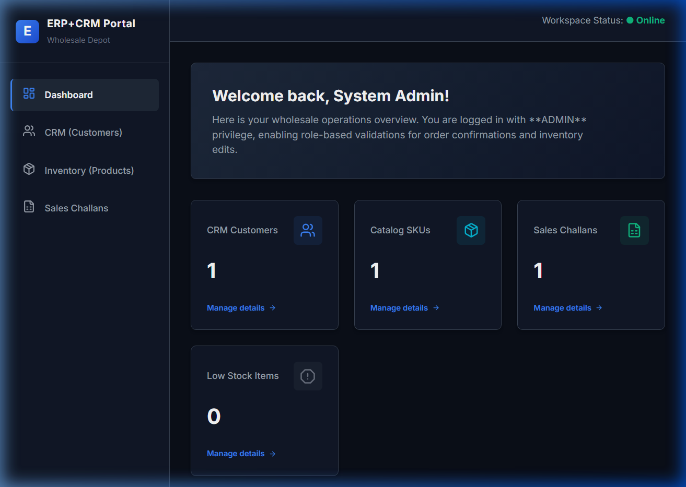
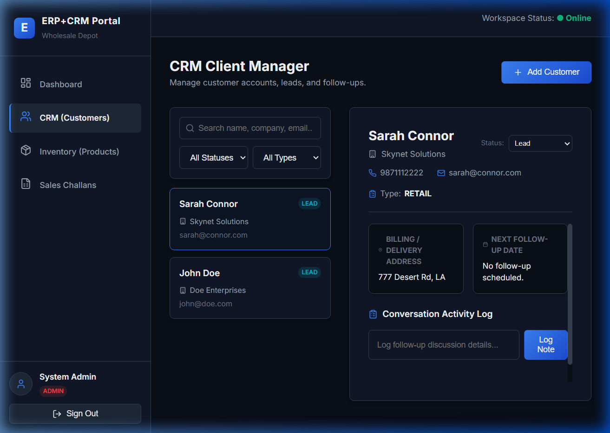
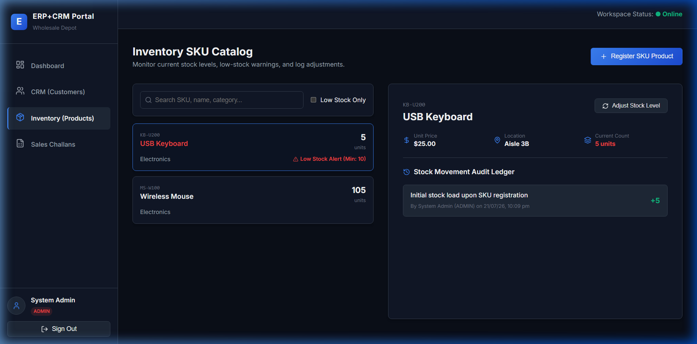

<<<<<<< HEAD
# 🚀 OpsPilot — Enterprise SaaS Commercial ERP Platform

OpsPilot is a commercial-grade, multi-tenant enterprise ERP & CRM platform designed with clean architecture, real-time analytics, automated workflow execution, and multi-location Indian logistics management.

---

## 📁 Repository Directory Structure

```text
fundsroom/
├── backend/                  # Node.js + Express + TypeScript + Prisma ORM Backend API
│   ├── src/
│   │   ├── config/           # Logger, Environment & Prisma Client
│   │   ├── controllers/      # CRM, Sales, Inventory, Accounts & Admin Controllers
│   │   ├── middlewares/      # JWT Authentication, RBAC Authorization, Error Handler
│   │   ├── routes/           # REST Endpoint Route Definitions
│   │   └── prisma/           # Database Seeder (seed.ts) & Migration Utilities
│   ├── prisma/
│   │   └── schema.prisma     # SQLite Enterprise Data Models
│   └── package.json
│
├── frontend/                 # React 19 + TypeScript + Vite + Tailwind CSS Frontend UI
│   ├── src/
│   │   ├── components/       # Reusable Layout, Navbar, Sidebar & Design System Primitives
│   │   ├── context/          # Auth & Theme Context Providers
│   │   ├── lib/              # API Client (Axios) & Indian Rupee (₹) Utilities
│   │   └── pages/            # Dashboard, CRM, Sales, Challans, Warehouse & Reports
│   └── package.json
│
├── .git/                     # Git Version Control Repository
├── vercel.json               # Vercel Deployment Configuration for Frontend
├── render.yaml               # Render Blueprint Deployment for Backend API
├── docker-compose.yml        # Docker Multi-Container Configuration
└── README.md                 # Project Overview & Deployment Guide
=======
# OpsPilot

**Enterprise ERP & CRM Operations Platform for Wholesale & Distribution Businesses**

---

## Overview

OpsPilot is a production-grade full-stack operations portal designed to streamline wholesale business processes. It integrates customer relationship tracking, live product stock metrics, role-based safety gates, and atomic sales order ledgers under a single, unified enterprise dashboard.

---

## Features

- **Secure JWT Session Management**: Salted password hashing with `bcryptjs` and session tokens signed with `jsonwebtoken`.
- **Role-Based Access Control (RBAC)**: Strict permission boundaries mapping actions across `ADMIN`, `SALES`, `WAREHOUSE`, and `ACCOUNTS` privileges.
- **Client CRM Suite**: Dual-pane account search directories, status transitions (Leads $\rightarrow$ Active), and complete follow-up note logging streams.
- **Inventory SKU Ledger**: Location tracking, low-stock threshold warnings, and atomic stock adjustment records.
- **Atomic Sales Challans**: Dynamic line-item order builders featuring product catalog price snapshotting, unique Challan number generation, and automatic stock checks.
- **Prisma Transactions**: Secure database transactions prevent database inconsistency errors on order fulfillment.
- **Glassmorphic Slate UI**: Sleek, high-fidelity dark-mode interface built on CSS variables and styled components.

---

## Technology Stack

### Frontend Client
- React (Hooks, Context)
- TypeScript
- Vite
- React Router
- Axios (with network interceptors for token headers)
- Lucide React (vector assets)
- Vanilla CSS Variables

### Backend Server
- Node.js
- TypeScript
- Express.js
- Prisma ORM
- SQLite (Local development) / PostgreSQL (Neon production)

---

## Project Architecture

```
React Frontend (client) 
       ↓ (HTTP REST Requests with JWT Bearer Token)
Express Backend Router (server)
       ↓ (authenticateJWT & requireRole Middleware Gates)
Prisma ORM Transaction Layer
       ↓ (SQLite / PostgreSQL Database Engine)
```

---

## Folder Structure

```
OpsPilot/
├── client/                     # React frontend source files
│   ├── src/
│   │   ├── api/                # Axios configuration & interceptors
│   │   ├── components/         # Navigation sidebar layout shell
│   │   ├── context/            # Global Auth Context session provider
│   │   ├── pages/              # Views (Dashboard, CRM, Catalog, Challans)
│   │   ├── App.tsx             # Routing configuration
│   │   └── index.css           # CSS Variable Design system
│   └── package.json
├── server/                     # Express Node backend source files
│   ├── prisma/
│   │   ├── migrations/         # Database migration history
│   │   └── schema.prisma       # Database schema configuration
│   ├── src/
│   │   ├── middleware/         # Security & RBAC check gates
│   │   ├── routes/             # REST route mappings
│   │   ├── types.ts            # TypeScript request extension definitions
│   │   └── index.ts            # Server bootstrap entrypoint
│   ├── .env                    # Local credentials (ignored by git)
│   └── package.json
├── screenshots/                # Application validation images
├── .env.example                # Example configuration template
├── LICENSE                     # MIT Terms License
├── README.md                   # Enterprise documentation
└── .gitignore                  # Git tracking exclusion filters
>>>>>>> 3e057677c318aa45e96404a336a1757f4fa77536
```

---

<<<<<<< HEAD
## 🛠 Tech Stack

### **Frontend (`/frontend`)**
- **Framework**: React 19, TypeScript, Vite
- **Styling**: Tailwind CSS, Vanilla CSS Glassmorphism
- **Icons & Visuals**: Lucide React Icons
- **State & Query**: React Query (`@tanstack/react-query`), Context API
- **Charts**: Recharts (Dynamic Indian Rupee ₹ Y-axis scaling: K, L, Cr)
- **Routing**: React Router v6

### **Backend (`/backend`)**
- **Runtime**: Node.js + Express (TypeScript)
- **ORM & Database**: Prisma ORM v5 + SQLite (`dev.db`)
- **Security & Auth**: JWT Tokens, Bcrypt (12 salt rounds), Helmet, Express Rate Limit
- **Architecture**: Controller Layer → Service Layer → Repository Layer → Prisma ORM

---

## 🔑 Demo Login Credentials

| Role | Email | Password | Access Rights |
|---|---|---|---|
| **Admin** | `admin@opspilot.com` | `password123` | Full System Access |
| **Sales** | `sales@opspilot.com` | `password123` | CRM, Sales Orders, Challans, Quotes |
| **Warehouse** | `warehouse@opspilot.com` | `password123` | Multi-Warehouse Stock & Receiving |
| **Accounts** | `accounts@opspilot.com` | `password123` | Invoices, Financial Ledger & Expenses |

---

## 🚀 Quickstart & Local Setup

### 1. Install Dependencies
```bash
# Install root, backend, and frontend packages
npm install
npm install --prefix backend
npm install --prefix frontend
```

### 2. Database Generation & Seeding
```bash
cd backend
npx prisma generate
npx prisma db push
npx tsc
node dist/prisma/seed.js
```

### 3. Start Development Servers
```bash
# Terminal 1: Run Backend API (Port 5000)
npm run dev --prefix backend

# Terminal 2: Run Frontend Portal (Port 5173)
npm run dev --prefix frontend
```

---

## ☁️ Production Deployment

### **Deploying Frontend to Vercel (`vercel.json`)**
1. Connect your repository to [Vercel](https://vercel.com).
2. Set Root Directory to `./` (uses `vercel.json` rewrite configuration).
3. Set Environment Variable: `VITE_API_URL=https://your-backend-api.onrender.com/api`.

### **Deploying Backend to Render (`render.yaml`)**
1. Import repository into [Render](https://render.com) using **New Web Service / Blueprint**.
2. Render detects `render.yaml` automatically.
3. Build Command: `cd backend && npm install && npx prisma generate && npx prisma db push && npm run build`
4. Start Command: `node backend/dist/index.js`
=======
## Installation & Setup

### Prerequisites
- Node.js LTS installed globally on your machine.
- Git version control.

### Setup Instructions

1. **Clone and Navigate**:
   ```bash
   git clone https://github.com/<YOUR_GITHUB_USERNAME>/OpsPilot.git
   cd OpsPilot
   ```

2. **Configure Backend Environment**:
   - Navigate to the `server/` directory:
     ```bash
     cd server
     ```
   - Copy the environment file template:
     ```bash
     cp ../.env.example .env
     ```
   - Install server-side packages:
     ```bash
     npm install
     ```
   - Generate local database tables and Prisma client types:
     ```bash
     npx prisma migrate dev --name init
     ```
   - Start the backend server:
     ```bash
     npm run dev
     ```
     *(Server runs on http://localhost:5000)*

3. **Configure Frontend Client**:
   - Open a new terminal session and navigate to the `client/` directory:
     ```bash
     cd client
     ```
   - Install client packages:
     ```bash
     npm install
     ```
   - Start the Vite local server:
     ```bash
     npm run dev
     ```
     *(Application opens on http://localhost:5173)*

4. **Sign In**:
   - Load http://localhost:5173/ in your browser.
   - Access the admin account using:
     - **Email**: `admin@company.com`
     - **Password**: `securepassword`

---

## API Documentation

### 1. Authentication
- `POST /api/auth/register` - Registers a new user. *(Bootstrap security: Allows registering the first admin without tokens if the database is empty; otherwise requires an Admin token).*
- `POST /api/auth/login` - Verifies passwords and signs a 24h JWT session token.
- `GET /api/auth/me` - Resolves logged-in user profile attributes.

### 2. CRM (Customers)
- `GET /api/customers` - Lists customers with search/type/status filtering.
- `POST /api/customers` - Creates a customer record. *(Requires ADMIN or SALES).*
- `GET /api/customers/:id` - Pulls profile details joined with conversation notes.
- `PATCH /api/customers/:id` - Updates address, status, or contact values.
- `POST /api/customers/:id/notes` - Appends a conversation log note. *(Requires ADMIN or SALES).*

### 3. Inventory (Products)
- `GET /api/products` - Lists catalog items with low-stock status flags.
- `POST /api/products` - Registers a new SKU. *(Requires ADMIN or WAREHOUSE).*
- `POST /api/products/movements` - Log manual adjustments (IN/OUT restocks). *(Requires WAREHOUSE or ADMIN).*
- `GET /api/products/:id/movements` - Loads the complete audit ledger for a specific SKU.

### 4. Sales Challans
- `GET /api/challans` - Lists orders with status filters.
- `GET /api/challans/:id` - Retrieves detailed order lists with product catalog snapshots.
- `POST /api/challans` - Generates a new invoice (Draft or Confirmed).
- `POST /api/challans/:id/confirm` - Confirms a draft order, triggering inventory decrement. *(Requires SALES or ADMIN).*

---

## Visual Walkthrough

### 1. Login Screen


### 2. Enterprise Dashboard


### 3. CRM Client Manager


### 4. Inventory SKU Catalog


---

## Deployment Configuration

- **Frontend Client**: Deploy the `client/` folder as a static site to **Vercel** or **Netlify**. Ensure redirect rewrites are configured for Single Page Apps (SPA) fallback to `index.html`.
- **Backend Server**: Deploy the `server/` folder to **Render** or **Railway**. Define startup environment properties:
  - `DATABASE_URL` pointing to your Supabase / Neon PostgreSQL cluster.
  - Set `PRISMA_CLI_BINARY_TARGETS=native` to allow compilation target matching on cloud servers.

---

## License

This project is licensed under the terms of the MIT License. Refer to the [LICENSE](LICENSE) file for usage terms.
>>>>>>> 3e057677c318aa45e96404a336a1757f4fa77536
